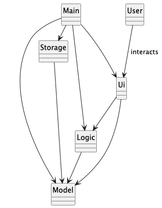
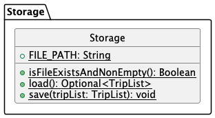
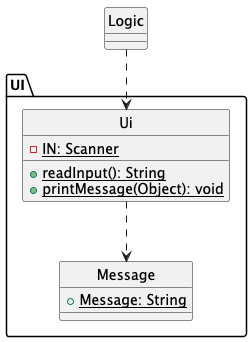
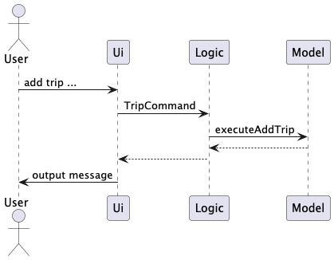
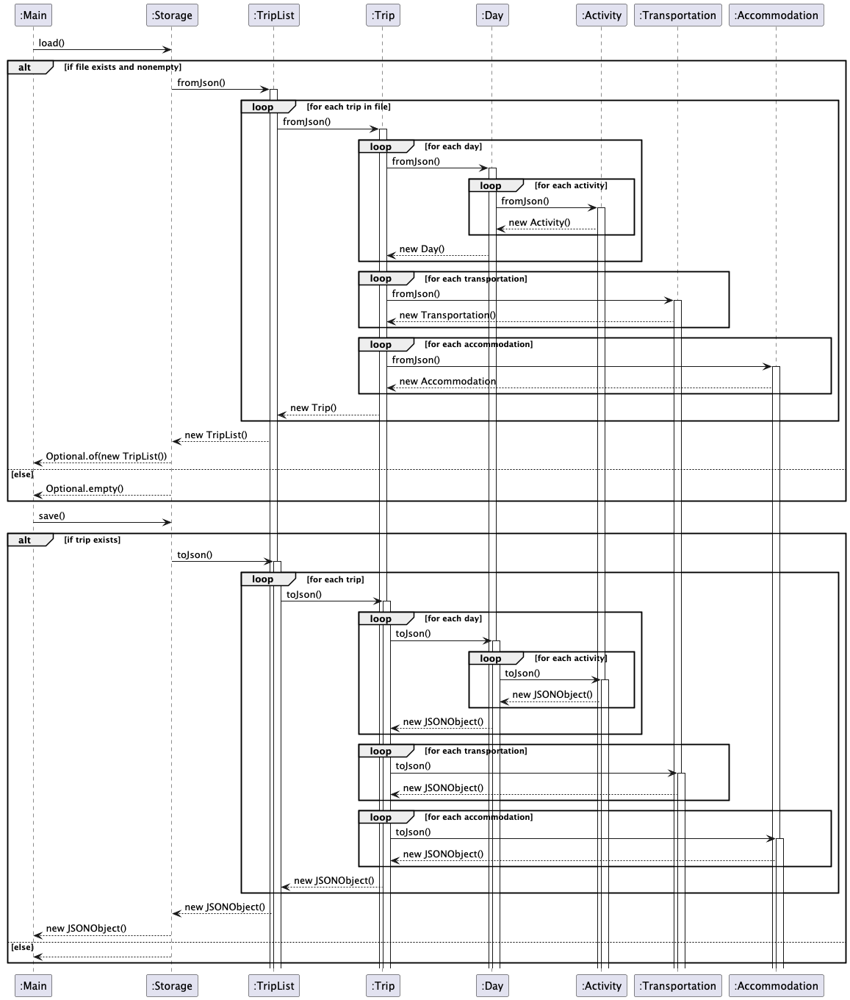
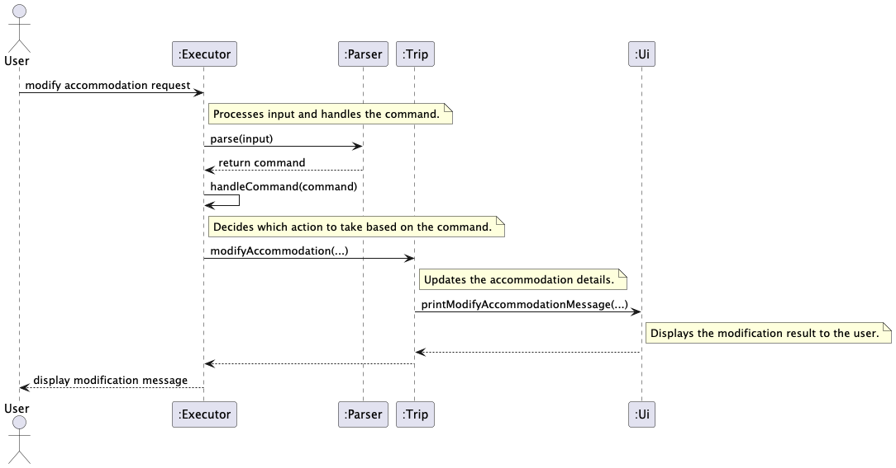

# Developer Guide (7 Apr)

## Table of Contents
- [Acknowledgements (6 Apr)](#acknowledgements)
- [Get Started (4 Apr)](#get-started)
    - [Setting up (4 Apr)](#setting-up)
- [Design](#design)
  - [Architecture (7 Apr)](#architecture)
    - [Storage Component](#storage-component)
    - [Ui Component](#ui-component)
    - [Logic Component](#logic-component)
    - [Model Component](#model-component)
- [Implementation](#implementation)
    - [Storage [Implemented] (6 Apr)](#storage-proposed)
      - [How it works](#how-it-works)
        - [Loading](#loading)
        - [Saving](#saving)
      - [UML Sequence Diagram](uml-sequence-diagram)
    - [Modify Accommodation [Implemented]](#modify-accommodation-implemented)
- [Git Workflow (15 Mar)](#git-workflow)
    - [Branch](#branch)
- [Code Standard (15 Mar)](#code-standard)
    - [Primitive Type](#primitive-type)
    - [Switch](#switch)
- [Documentation Standard (3 Apr)](#documentation-standard)
    - [Sytnax](#sytnax)
- [Appendix](#appendix)
    - [PlantUML](#plantuml)
        - [How to use](#how-to-use)

## Acknowledgements

- [PlantUML](https://plantuml.com/) for the UML diagrams
- [JSON-java](https://github.com/stleary/JSON-java/tree/master?tab=readme-ov-file) for json formatting

## Get Started

### Setting up

> ℹ️ This section is only for the developer who want to run the project locally, 
> if you are not a developer, please refer to [User Guide](UserGuide.md) instead.

> ℹ️ Logger information is hidden by default,
> if you wish to enable logger for debugging purpose, 
> please pass argument `--verbose` when running the jar file.
> ie java -jar VoyaTrip.jar --verbose

## Design

### Architecture
The architecture of the application is designed to be modular and easy to maintain.  

**Main Components**:

> ℹ️ The components referring here are not particular classes 
> instead high level ideas or packages we can say

- **Main**: The entry point of the application, 
responsible for initializing the application and handle program specific parameters
- **Ui**: The user interface component,
handle all the user inputs and program outputs
- **Storage**: The storage component,
handle all the file reading and writing
- **Logic**: The logic component,
handle all the actual execution of the commands
- **Model**: The model component,
handle all the data structure and data manipulation

Simple diagram is included to show the relationship among these components.

  

The interaction for any command is similar to the following, for simplicity, we will use `add trip` as an example:

#### Storage Component



#### Ui Component



#### Logic Component

#### Model Component



## Implementation
This section describes some notable details on how certain features are implemented/going to be implemented.

### Storage [Implemented]

- This is implemented by using the `Storage` class, 
which is responsible for reading and writing data to and from the file system.

- Diagram is included at the end to show the relationship
between the `Storage` class and other classes in the system.

> ℹ️ The `Storage` class is implemented with external library `org.json`
> to handle the JSON file format.

#### How it works

##### Loading 

1. The `Storage` class reads the JSON file from the file system.
2. It parses the JSON data into Java objects using the `org.json` library.
3. The parsed data is then passed into static fromJson() of 
`TripList` which then invoke the same methods of related `Trip`, `Day`, `Activity`, `Transportation` and `Accommodation` classes 
to create the corresponding objects recursively.
4. The created objects are then returned to the `Main` class,
and being assigned to the `tripList` variable if needed.

> ⚠️ This method will return a `Optional<TripList>` object 
> instead of the triplist directly.

##### Saving 

1. `TripList` object is passed into the `Storage` class.
2. The `Storage` class then calls `toJson()` method of `TripList` class, 
which again invoke the same methods of the related objects to 
return a JSON object 
3. The JSON object is then converted to string 
with indentation of 4 spaces for better json format

> ⚠️ This method will create/ overwrite the file if it does not exist,
> and will delete the files if the triplist object is empty.

#### UML Sequence Diagram
 

### Modify Accommodation [Implemented]
The 'modify accommodation' feature is facilitated by calling `modifyAccommodation` in the `Trip` class, which is responsible 
for updating the details of existing accommodation in the `accommodations` list, based on the modifications provided. 
Here is the overview of the whole modification operation:



### Implementation Details
1. **Role of `Parser`**:
  - The `Parser` class takes the input from the user and transforms it into a `AccommodationCommand` object using the `parse` method.

2. **Role of `handleCommand`**:
  - After receiving the `AccommodationCommand` object, `handleCommand(command)` is called within the `Executor`, which determines the appropriate action (like invoking `modifyAccommodation`).

3. **Role of `Trip`**:
  - The `modifyAccommodation(...)` method is called to perform the changes to the trip accommodation data.

4. **`Ui` Feedback**:
  - After all successful updates, the `Trip` class calls the `printModifyAccommodationMessage` method on the `Ui` class
      to provide clear visual feedback to the user about the successful modification.

### Example Workflow of `modifyAccommodation` in `Trip`
#### Scenario:
A trip named 'My Trip' has three accommodations stored in the `accommodations` list. We want to modify the second accommodation by:
- Changing its name to `"Courtyard Resort"`.
- Updating its budget to `$500`.
- Leaving the booked days unchanged (`null` for `accommodationDays`).

#### Input Arguments:
```
~/My Trip/Accommodation >
modify accom --index 2 --n Courtyard Resort --b 500
```

#### Execution:
1. `accommodationName != null`: Updates the name to `"Courtyard Resort"` by calling `setName` of the accommodation.
2. `accommodationBudget != null`: Updates the budget to `500` by calling `setBudget` of the accommodation.
3. `accommodationDays == null`: Days remain unchanged.
4. After modifications, `Ui.printModifyAccommodationMessage` is called to display a confirmation message.


## Git Workflow

### Branch

Please try to use consistent branch name style if applicable
- developing a new feature: `dev/<issueNumber>-<description>`, ie `dev/8-add-delete-trip
- fixing a bug: `fix/<issueNumber>-<description>`, ie `fix/8-incorrect-output`

## Code Standard

Basically follow the same as cs2113 guideline yet here will have some more specific guideline if not found in cs2113 website.

> ℹ️ This documentation will only add new thing from time to time, but will **not** change pre-defined standard, hence please check for any updates from time to time. (deprecated)

> ℹ️ For easy workflow, this issue's name will ends with last updated date for the reference.
> And the latest update will be denoted by * in table of contents. (deprecated)

### Primitive Type

Please use encapsulated primitive type, ie `Integer` instead of `integer`

### Switch

Please use the lambda style of switch statement to avoid the tedious break statement, ie

```java
switch (x) {
case "a" -> System.out.println("a");
case "b" -> System.out.println("b");
default -> System.out.println("others");
}
```

## Documentation Standard

### important notes

- please dont **remove** the old documentation, but instead **~~strikethrough~~** or append (deprecated) at the end
- after update the documentation, please make sure to list the latest version on the [table of contents](#table-of-contents), ie Code Standard (15 Mar)

## Appendix

### PlantUML

PlantUML is the software/code I used to generate the uml diagram.

#### How to use

1. Download the PlantUML plugin in your own IDE, it is available for both IntelliJ and VSCode
> ℹ️ Make sure you have also download the graphviz
> Check it by typing `brew info graphviz` in linux environment terminal
> Install it by typing `brew install graphviz` in linux environment terminal
2. Please refer to the official documents to start code it, you can check it [here](https://plantuml.com/en-dark/class-diagram). It is a generally powerful and easy tool not only to general uml, you may check there main page for more information
3. Make sure you end the uml document with `.puml` but  **not** `.uml`
